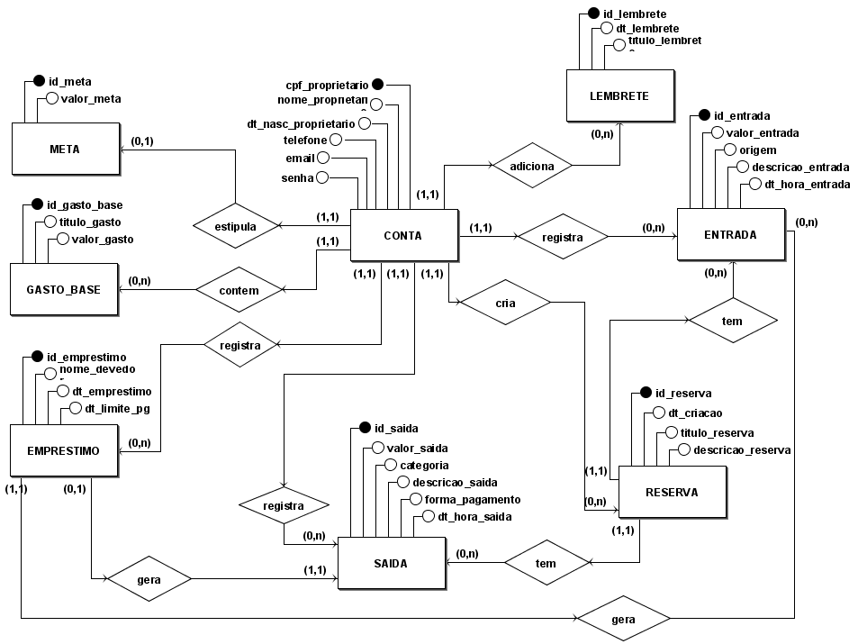
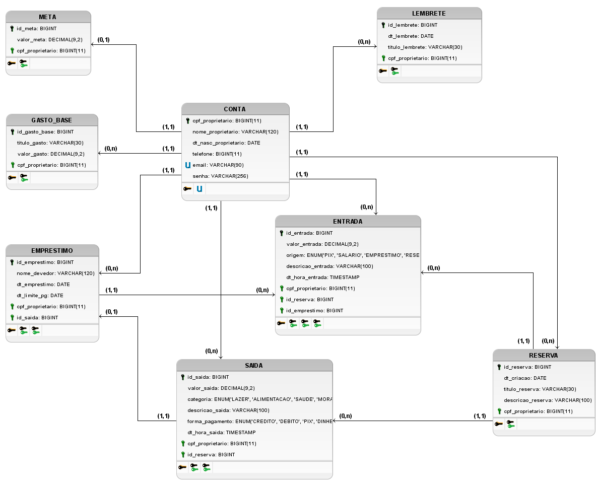

# Banco de dados

## Modelo Entidade Relacionamento (MER)

### Entidades

- USUARIO
- CONTA
- SAIDA
- ENTRADA
- META
- RESERVA
- LEMBRETE
- EMPRESTIMO

### Atributos

- CONTA (<u>cpf_proprietario</u>, nome_proprietario, email, telefone, dt_nasc_proprietario, senha)
- SAIDA (<u>id_saida</u>, valor_saida, categoria, descricao_saida, forma_pagamento, dt_hora_saida, cpf_proprietario, id_reserva)
- ENTRADA (<u>id_entrada</u>, valor_entrada, origem, descricao_entrada, dt_hora_entrada, cpf_proprietario, id_reserva, id_emprestimo)
- META (<u>id_meta</u>, valor_meta, cpf_proprietario)
- RESERVA (<u>id_reserva</u>, dt_criacao, titulo_reserva, descricao_reserva, cpf_proprietario)
- LEMBRETE (<u>id_lembrete</u>, dt_lembrete, titulo_lembrete, cpf_proprietario)
- EMPRESTIMO (<u>id_emprestimo</u>, nome_devedor, dt_emprestimo, dt_limite_pg, cpf_proprietario, id_saida)
- GASTO_BASE(<u>id_gasto_base</u>, titulo_gasto, valor_gasto, cpf_proprietario)

### Relacionamentos

- USUARIO - possui - CONTA
  Um usuario possui uma conta, e uma conta só pode ser possuida por um usuario.
  Cardinalidade **1:1**
  
- CONTA - registra - SAIDA
  Em uma CONTA pode-se registrar nenhuma, uma ou mais SAIDA(s) e uma SAIDA só pode ser registrada em uma CONTA.
  Cardinalidade **1:n**
  
- CONTA - registra - ENTRADA
  Em uma CONTA pode-se registrar nenhuma, uma ou varias ENTRADA(s) e uma ENTRADA só pode ser registrada em uma CONTA.
  Cardinalidade **1:n**

- CONTA - estipula - META
  Em uma CONTA pode-se estipular nenhuma, uma META e uma META só pode ser registrada em uma CONTA.
  Cardinalidade **1:1**

- CONTA - cria - RESERVA
  Em uma CONTA pode criar nenhuma, uma ou varias RESERVA(s) e uma RESERVA so pode ser criada em uma CONTA.
  Cardinalidade **1:n**
  
- CONTA - contém - GASTOS_BASE
  Em uma CONTA pode-se conter nenhum, um ou varios "GASTO(s) BASE" e um "GASTO BASE" so pode ser contido em uma CONTA.
  Cardinalidade **1:n**
  
- CONTA - adiciona - LEMBRETE
  Em uma CONTA pode-se adicionar nenhuma, uma ou varios LEMBRETE(s) e um LEMBRETE so pode ser adicionado em uma CONTA.
  Cardinalidade **1:n**
  
- CONTA - registra - EMPRESTIMO
  Em uma CONTA pode-se inscrever nenhum, um ou varios EMPRESTIMO(s) e um EMPRESTIMO so pode ser registrado em uma CONTA.
  Cardinalidade **1:n**
  
- RESERVA - tem - SAIDA
  Uma RESERVA pode ter nenhuma, uma ou varios SAIDA(s) e uma SAIDA so pode ter uma RESERVA.
  Cardinalidade **1:n**

- RESERVA - tem - ENTRADA
  Uma RESERVA pode ter nenhuma, uma ou varias ENTRADA(s) e uma ENTRADA so pode ter uma RESERVA.
  Cardinalidade **1:n**
  
- EMPRESTIMO - gera - SAIDA
  Um EMPRESTIMO gera uma SAIDA e uma SAIDA so pode gerar um EMPRESTIMO.
  Cardinalidade **1:1**

- EMPRESTIMO - gera - ENTRADA
  Um EMPRESTIMO pode gerar nenhuma, uma ou varias ENTRADA(s) e uma ENTRADA so pode ser gerada por um EMPRESTIMO.
  Cardinalidade **1:n**

## Diagrama Entidade Relacionamento (DER)

## Diagrama Logico de Dados (DLD)

## Versionamento

| Data       | Descrição                           | Autor(es)                                                                                                                                                  |
| :--------: | ----------------------------------- | ---------------------------------------------------------------------------------------------------------------------------------------------------------- |
| 21/02/2023 | Modelagem inicial do banco de dados | [Daniel Viana](https://github.com/danielvimot), [Lameque Fernandes](https://github.com/lamequefernandes), e [Oziel Humasi](https://github.com/ozielhumasi) |
